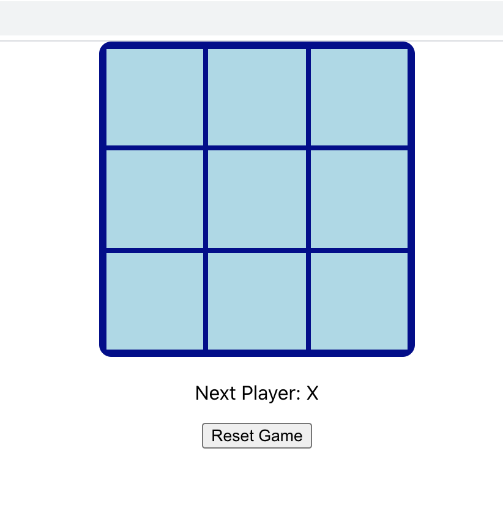

# Tic Tac Toe Game - Build using React Hooks

> Followed a tutorial on [Scrimba](https://scrimba.com/course/greactgame/enrolled) to build the classic Tic Tac Toe game using modern React and React Hooks.
>
> [Live demo](https://stefi.codes/tic-tac-toe-hooks/)



## Technologies

This app was build with:

- [React](https://reactjs.org/docs/create-a-new-react-app.html)

## Install

```
git clone https://github.com/stefi23/tic-tac-toe-hooks
$ cd movie-search-app
$ npm install
$ npm start
```
